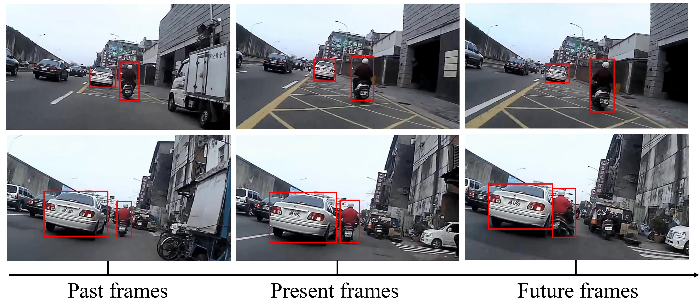
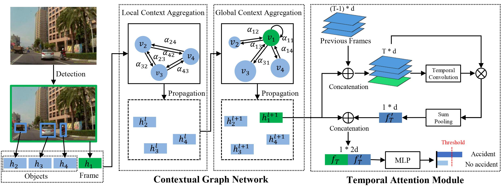

# DAA-GNN
Dynamic Attention Augmented Graph Network for Video Accident Anticipation

## Demo
<div align="center">
  
</div>

## Pipeline
<div align="center">
  
</div>

## Reproduction

We recomend you to setup in the following steps:

1. Clone the repo.
```
git clone https://github.com/ZxyLinkstart/DAA-GNN
```

2. Create conda environment
```
conda env create -f environment.yml
conda activate DAA-GNN
```

## We will upload the pre-trained models.
